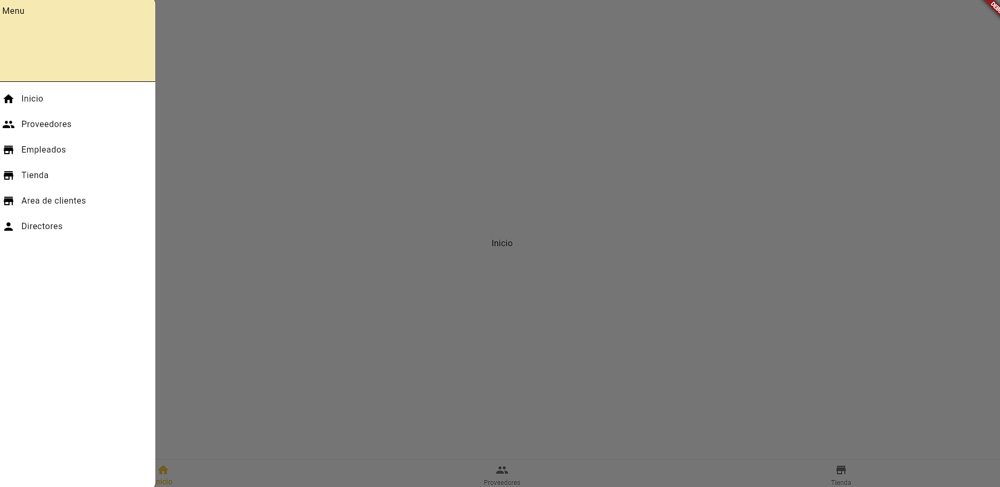
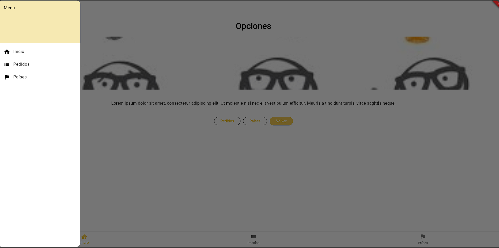

<h1> Flutter básico </h1>

Este es un proyecto básico de Flutter con ejemplos y características para aprender a usar Flutter.

## Cómo clonar y ejecutar el proyecto

Sigue estos pasos para clonar el proyecto desde GitHub y ejecutarlo en tu máquina local.

### Requisitos previos

- Tener instalado [Flutter SDK](https://flutter.dev/docs/get-started/install) en tu máquina.
- Tener configurado un emulador o dispositivo físico para pruebas.
- Git instalado para clonar el repositorio. Si no lo tienes, [instala Git aquí](https://git-scm.com/downloads).

### Pasos para clonar el repositorio

1. Abre tu terminal o Git Bash en tu computadora.
2. Navega a la carpeta donde quieres clonar el proyecto con el siguiente comando:
   ```bash
   cd /ruta/donde/quieres/clonar
3. Clona el repositorio ejecutando el siguiente comando:
   ```
   git clone https://github.com/Maycol127/Flutter-basico.git
4. Entra en el directorio del proyecto:
   ```
   cd Flutter-basico 
5. Instala las dependencias necesarias de Flutter:
   ```
   flutter pub get
6. Ejecuta la aplicación en un emulador o dispositivo conectado:
   ```
   flutter run

<h2> Capturas de pantalla </h1>




